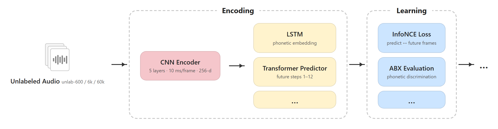

# flowchart-draw

An agent skill that reads NLP/ML papers by **DOI or arXiv URL**, finds methodology and baseline sections described in prose without flowcharts, and generates **colored HTML pipeline diagrams** for readers.

## Overview



*Example output — CPC unsupervised baseline from [Libri-Light (arXiv:1912.07875)](https://arxiv.org/abs/1912.07875). Sources: [HTML](examples/libri-light-cpc-pipeline.html) · [PNG](examples/libri-light-cpc-pipeline.png)*

## Why I need flowchart-draw

When reading NLP or speech papers, authors often describe baselines and pipelines in long paragraphs — encoder stacks, loss functions, preprocessing steps — but provide **no figure** to visualize the flow. Reconstructing the architecture from text alone is slow and error-prone, especially when comparing multiple baselines (unsupervised vs semi-supervised vs distant supervision).

I built **flowchart-draw** so an agent can:

- Pull the full paper from a DOI or PDF link
- Detect which sections are crying out for a diagram
- Ask me which pipeline to draw (never auto-draw without confirmation)
- Output a clean, self-contained HTML flowchart I can open in any browser

The visual style follows a consistent pattern: **dashed stage boxes** to segment phases, **colored step boxes** inside each stage, and **black arrows** for process order — the kind of diagram papers should have included in the first place.

---

## Main functions

| Step | What it does |
|------|----------------|
| **1. Fetch** | Resolve DOI / arXiv URL → title, abstract, full text via OpenAlex, Semantic Scholar, arXiv, and PDF fallbacks |
| **2. Detect** | Scan Method / Baselines / Architecture sections for sequential pipeline descriptions that lack nearby figures |
| **3. Confirm** | Present candidate pipelines and ask which to visualize |
| **4. Draw** | Generate standalone HTML with dashed stage containers, colored boxes, and black arrows |
| **5. Deliver** | Save to `diagrams/<paper-slug>-pipeline.html` and offer tweaks |
| **6. Edit SVG** | Produce or update vector `.svg` for Inkscape / Figma / LaTeX (labels, colors, layout) |
| **7. Export PNG** | Convert HTML diagram to high-resolution `.png` via `scripts/html_to_png.py` |

**Trigger phrases:** `Draw the pipeline for DOI …`, `visualize the baselines`, `flowchart from this paper`, `edit the SVG`, `export to PNG`.

**Dependencies:**

```bash
# PDF text extraction (optional)
pip install pymupdf

# HTML → PNG export
pip install playwright
playwright install chromium
```

Or install everything: `pip install -r requirements.txt && playwright install chromium`

---

## Reference flowchart style

Diagrams follow the spec in [`references/style-guide.md`](references/style-guide.md) and start from [`templates/pipeline-diagram.template.html`](templates/pipeline-diagram.template.html).

**Layout pattern (left → right):**

```
[Input] → | dashed: Preprocessing | → | dashed: Encoding | → | dashed: Learning | → [Metric/Output]
              pink boxes                 yellow boxes           blue boxes
```

**Visual rules:**

- Dashed rounded rectangles (`.stage`) group related steps; stage name floats above the border
- Colored rounded boxes: pink (early/input), yellow (intermediate), blue (loss/training), green (output)
- Black horizontal arrows (`.arrow`) between stages and sequential steps
- Optional input icon block on the far left (documents, audio waveform, etc.)
- White background, no dark theme — suitable for papers and slides

**Example output** (generated from [Libri-Light, arXiv:1912.07875](https://arxiv.org/abs/1912.07875)) — see [Overview](#overview) above, or [`examples/libri-light-cpc-pipeline.html`](examples/libri-light-cpc-pipeline.html).

---

## Edit SVG diagrams

For vector editing (slides, papers, Inkscape/Figma), generate or edit an `.svg` alongside HTML.

**Template:** [`templates/pipeline-diagram.template.svg`](templates/pipeline-diagram.template.svg)

**Typical edits:**
- Rename steps — change `<text class="box-label">…</text>`
- Adjust colors — update `fill` on box `<rect>` (same palette as HTML)
- Move or add boxes — edit `x`/`y`/`width`/`height` and arrow `<line>` elements

Full guide: [`references/svg-editing.md`](references/svg-editing.md)

**Agent prompt examples:**
```
Edit the SVG — rename "LSTM" to "BiLSTM" and make the Learning stage blue
Save this pipeline as SVG for my Beamer slide
```

---

## Export HTML → PNG

Convert any generated HTML diagram to a high-resolution PNG:

```bash
python scripts/html_to_png.py diagrams/my-pipeline.html
python scripts/html_to_png.py diagrams/my-pipeline.html -o figures/my-pipeline.png --scale 2
```

| Flag | Description |
|------|-------------|
| `--selector .diagram` | Crop to diagram region (default) |
| `--scale 2` | Retina quality (use `3` for print) |
| `--full-page` | Capture entire page (multi-row layouts) |

Full guide: [`references/png-export.md`](references/png-export.md)

**Agent prompt examples:**
```
Export the Libri-Light pipeline as PNG
Turn diagrams/cpc-unsupervised-baseline.html into a 2x PNG for my paper
```

---

## Install

Clone once, then copy or symlink into your agent's skills directory.

### Cursor

**Personal skill** (all projects):

```bash
git clone https://github.com/xiaoxuankang/flowchart-draw.git ~/.cursor/skills/flowchart-draw
```

**Project skill** (shared with repo collaborators):

```bash
git clone https://github.com/xiaoxuankang/flowchart-draw.git .cursor/skills/flowchart-draw
```

Docs: [Cursor Skills](https://cursor.com/docs/context/skills)

### Claude Code

**Personal skill:**

```bash
git clone https://github.com/xiaoxuankang/flowchart-draw.git ~/.claude/skills/flowchart-draw
```

**Project skill:**

```bash
git clone https://github.com/xiaoxuankang/flowchart-draw.git .claude/skills/flowchart-draw
```

### Hermes Agent

**Primary skills directory:**

```bash
git clone https://github.com/xiaoxuankang/flowchart-draw.git ~/.hermes/skills/flowchart-draw
```

**Shared with other agents** — add to `~/.hermes/config.yaml`:

```yaml
skills:
  external_dirs:
    - ~/.agents/skills
```

Then clone into the shared path:

```bash
mkdir -p ~/.agents/skills
git clone https://github.com/xiaoxuankang/flowchart-draw.git ~/.agents/skills/flowchart-draw
```

Docs: [Hermes Skills](https://github.com/NousResearch/hermes-agent/blob/main/website/docs/user-guide/features/skills.md)

### OpenClaw

**Global** (all local agents):

```bash
openclaw skills install git:xiaoxuankang/flowchart-draw --global
```

Or clone manually:

```bash
git clone https://github.com/xiaoxuankang/flowchart-draw.git ~/.openclaw/skills/flowchart-draw
```

**Workspace-only** (current project):

```bash
openclaw skills install git:xiaoxuankang/flowchart-draw
# installs into ./skills/flowchart-draw
```

Docs: [OpenClaw Skills](https://docs.openclaw.ai/tools/skills)

---

## Usage

In any agent chat:

```
Draw the pipeline for https://arxiv.org/pdf/1912.07875
```

```
Draw the pipeline for DOI 10.18653/v1/N19-1423
```

Manual paper fetch:

```bash
cd flowchart-draw
python scripts/fetch_paper.py --doi "10.48550/arXiv.1912.07875" --output paper.json
python scripts/html_to_png.py examples/libri-light-cpc-pipeline.html -o examples/libri-light-cpc-pipeline.png
```

---

## Repository structure

```
flowchart-draw/
├── SKILL.md                 # Agent instructions (start here)
├── EXAMPLES.md
├── README.md
├── examples/                # Sample generated diagrams
├── references/
│   ├── style-guide.md       # Colors, layout, CSS
│   ├── svg-editing.md       # Vector edit workflow
│   ├── png-export.md        # HTML → PNG export
│   ├── detection-heuristics.md
│   └── paper-fetch.md
├── templates/
│   ├── pipeline-diagram.template.html
│   └── pipeline-diagram.template.svg
└── scripts/
    ├── fetch_paper.py
    └── html_to_png.py
```

---

## License

MIT — see [LICENSE](LICENSE).
