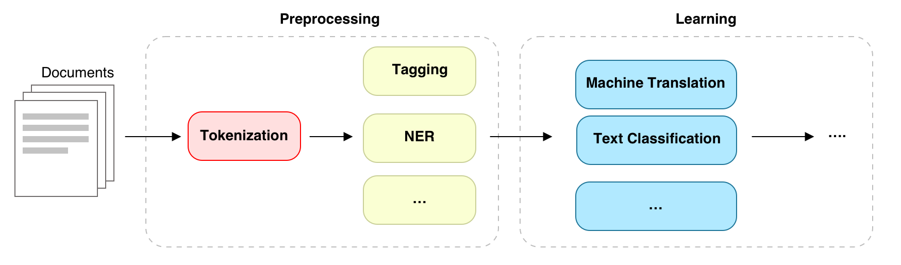

# flowchart-draw

An [Agent Skill](https://cursor.com/docs/context/skills) that reads NLP/ML papers by **DOI**, finds methodology and baseline sections described in prose without flowcharts, and generates **colored HTML pipeline diagrams** for readers.



## What it does

1. **Fetch** — Resolve DOI → title, abstract, full text (OpenAlex, Semantic Scholar, arXiv, PDF)
2. **Detect** — Scan for pipeline/baseline/architecture descriptions that lack nearby figures
3. **Confirm** — Ask which candidates you want visualized
4. **Draw** — Produce self-contained HTML with:
   - Dashed rounded rectangles to segment stages (Preprocessing, Learning, …)
   - Colored rounded boxes for each step
   - Black arrows showing process order

## Install

### Cursor (personal skill)

```bash
git clone https://github.com/xiaoxuankang/flowchart-draw.git ~/.cursor/skills/flowchart-draw
```

### Cursor (project skill)

```bash
git clone https://github.com/xiaoxuankang/flowchart-draw.git .cursor/skills/flowchart-draw
```

### Claude Code / Codex / OpenClaw

Copy the folder to your skills directory, e.g. `~/.claude/skills/flowchart-draw/` or `~/.codex/skills/flowchart-draw/`.

### Optional dependency

Better PDF text extraction:

```bash
pip install pymupdf
```

The fetch script works without it (uses Jina Reader and abstract fallbacks).

## Usage

In any agent chat:

```
Draw the pipeline for DOI 10.18653/v1/N19-1423
```

```
I read paper 10.1234/example — visualize the baselines
```

The agent will load this skill, fetch the paper, list pipeline candidates, and ask before drawing.

### Manual fetch

```bash
cd flowchart-draw
python scripts/fetch_paper.py --doi "10.18653/v1/N19-1423" --output paper.json
```

## Skill structure

```
flowchart-draw/
├── SKILL.md                 # Agent instructions (start here)
├── EXAMPLES.md
├── README.md
├── ref_pictures/            # Visual reference images
├── references/
│   ├── style-guide.md       # Colors, layout, CSS
│   ├── detection-heuristics.md
│   └── paper-fetch.md
├── templates/
│   └── pipeline-diagram.template.html
└── scripts/
    └── fetch_paper.py
```

## Output

Diagrams are saved as standalone HTML (e.g. `diagrams/bert-baseline-pipeline.html`). Open in any browser — no build step.

## Contributing

PRs welcome: detection heuristics, venue-specific parsers, SVG export, Mermaid fallback.

## License

MIT — see [LICENSE](LICENSE).
